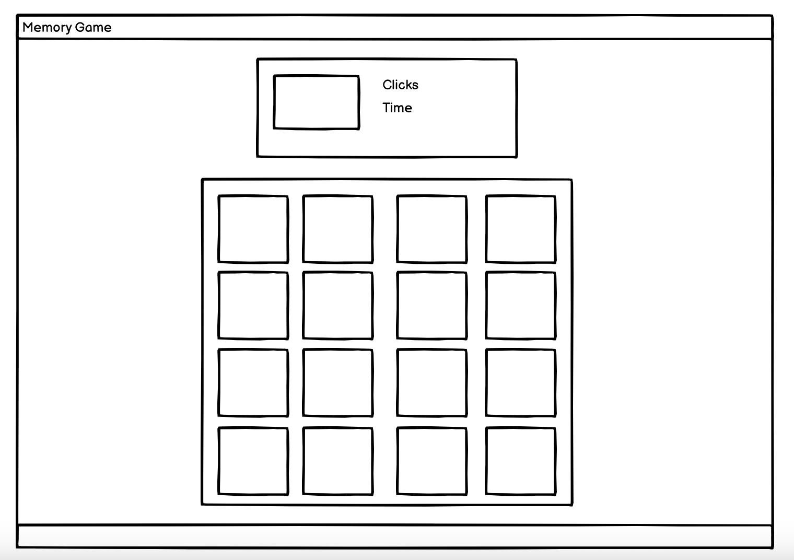
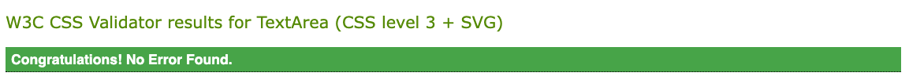
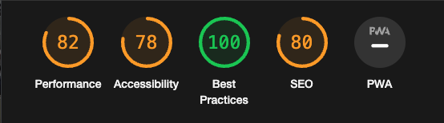
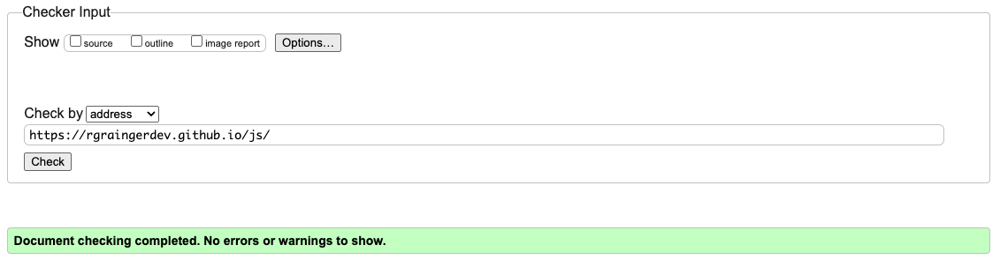

Welcome To this memory game where you can test you memory and see how many attemps it takes for you to complete.

## Getting Started

Visit https://rgraingerdev.github.io/js/ on your preferred web browser to access the Memory game.

## User Storys
I have developed user stories to direct my design and development process; in order to make sure that the game satisfies the requirements of my users. Here are some usage examples for user stories:

* As a fan of memory games i want to be able to quickly and conveniently start a new game so that i can engage with the game without delays.
* As a player i want to be able to play on diferent devices such as moblie phones and tablets, so i can enjoy anywhere.
* As a player i want to have a way to read the rules and mechanics of the game.
* i would like a scoreboard so i can see how i am doing against other players.
* i want the game to be simple so my children can play.

By developing user stories, I can make sure that the website satisfies user needs and offers a satisfying browsing experience. I regularly gather user feedback and apply it to the design and functionality of the website.

## UI/UX

* The aim is for a first-time user to be able to easily navigate.
* The colour scheme was chosen to be easy on the eye and not draw attention from the content with the intention of making it simple for a novice user to navigate. 
* This page was made so that adults and children have a quick and convinient way of playing.

### Future features
* Add a scoreboard to mesure your score against other players.
* Add a user input to dictate the size of the game.

## Wireframes
* I began my project with wireframing my design below:

* 

## Technologies used
* HTML - Was used for the structure of the page.
* CSS - was used for the style of elements.
* Github - is the hosting site for storing the code and version control.
* Javascript - used for interactivity of the site.
* balsamiq - used for wireframes.
* google fonts - used for the Quicksand font.
* Devtools - used for debugging and testing to ensure responsiveness.
* Google chrome lighthouse - used for testing.
* W3C HTML Validator - used for validating HTML of the page.
* W3C CSS validator - used for validating CSS of the page.

## Testing
The Memory game has undergone comprehensive testing to guarantee that it operates properly and offers a satisfying user experience. The website has been tested on a variety of hardware, browsers, and operating systems, including:

Systems running Windows, macOS, and Linux.
Web browsers such as Safari, Edge, Firefox and Chrome that can run on mobile and desktop.
I carried out user testing to gather opinions from people. I used this feedback to improve the website's functionality and appearance.

### Page Testing

Testing began with automated testing as per the table below with screenshots.

|Test |Lighthouse| W3 html validator| W3 schools jigsaw| 
|-----|-----|-----|-----|
|Main| Pass| Pass| Pass|

  

  

  

  

As part of this testing i also used Code institues JSHint tool and completed the recomendations from there to ensure the code was correct and to the proper standard. in this there are still a few remaining errors however these are all around the use of ES6.

### Manual testing

#### Main page

| Feature | Expect | Action | Result | Pass/Fail |
|-----|-----|-----|-----|-----|
|Restart game|All tiles to reset|clicked button|Tiles All reset|Pass|
|Restart game timer/score|On click to rertun to 0|Clicked restart|Counters return to 0|Pass|
|Tiles|On click tile to flip|clicked tile| tile flipped|Pass|
|Match|When same image shows stay flipped|Discovered a pair|Remained Flipped|Pass|
|Swal display on win|When all tiles flipped banner to show|flipped all tiles|Banner showed|Pass|

 
### bugs

* Duing development a bug was discovered when restarting the game. When pressing restart game the timer would occasionaly return to 0 but not restart the cound. this was resolved by moving the timer and moves element into the start game function.
* Shortly after deployment another bug was found when double clicking cards this apeared to break the game loop and no longer allow pairs to match. fix was discovered during testing when Lighthouse testing it was advised to remove unused element. when this was returned to the code error was resolved.
* On initial build tiles were dispayled as ',,,,,,,,,,,,,,' this was due to gramatical errors when selecting the image from the folder structure.

## Deployment
1. Navigate to the [repository](https://github.com/rgraingerdev/js)
2. Click on Settings on the top.
3. Click on Pages on the menu on the left which will open GitHub Pages window.
4. From the drop-down menu under source select deploy from branch.
5. From the drop-down menu under branch select main, this tells GitHub which branch to use for the deployment. Click Save.
6. The page should refresh, and the deployment link should appear.

## Creating a fork
1. Navigate to the [repository](https://github.com/rgraingerdev/js)
2. In the top-right corner of the page click on the fork button and select create a fork.
3. You can change the name of the fork and add description 
4. Choose to copy only the main branch or all branches to the new fork. 
5. Click Create a Fork. A repository should appear in your GitHub.

### Cloning Repository
1. Navigate to the [repository](https://github.com/rgraingerdev/js)
2. Click on the Code button on top of the repository and copy the link. 
3. Open Git Bash and change the working directory to the location where you want the cloned directory. 
4. Type git clone and then paste the link.
5. Press Enter to create your local clone.

## Sources
* [W3schools](https://www.w3schools.com/)
* [w3schools validator](https://validator.w3.org/)
* [w3schools jigsaw](https://jigsaw.w3.org/css-validator/)
* [Google fonts](https://fonts.google.com/)
* [Balsamiq](https://balsamiq.com/)
* [Github](https://github.com/flowforfrank/memory-game)
* [Stackoverflow](https://stackoverflow.com/)
* [Code Institute](https://codeinstitute.net/)
* [Youtube](https://www.youtube.com/)
* [Sweetalert](https://sweetalert.js.org/)

### images from:

## Acknowledgements
* Thank you to my mentor for supporting me through this project
* Everybody on slack for answering any questions I had along the way.
